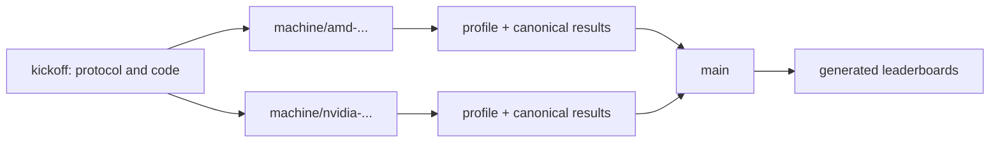

# HunyuanOCR-Bench

HunyuanOCR-Bench is the shared benchmark protocol for **HunyuanOCR-1.5** on
**OmniDocBench v1.6** across AMD and NVIDIA accelerators. The repository keeps
benchmark logic immutable on `kickoff`, stores one machine's evidence on each
`machine/<machine-id>` branch, and aggregates accepted results on `main`.

The two primary outputs are:

1. **Speed**: average end-to-end page latency and page/s under concurrency 1.
2. **Accuracy**: the official OmniDocBench v1.6 columns:

| Model Type | Model Size | Overall↑ | TextEdit↓ | FormulaCDM↑ | TableTEDS↑ | TableTEDS_S↑ | OrderEdit↓ |
| --- | --- | ---: | ---: | ---: | ---: | ---: | ---: |
| End2End Expert OCR Models | 1B | 94.74 | 0.039 | 94.50 | 93.67 | 94.71 | 0.129 |

The row above is the HunyuanOCR-1.5 reference from Table 12 of
[arXiv:2607.04884v2](https://arxiv.org/pdf/2607.04884v2), not a local result.

## Benchmark Contract

The immutable contract lives in [protocol/benchmark-v1.json](protocol/benchmark-v1.json):

- HunyuanOCR code: `c55965d3da1e6f41987abec8068f2e70851318bc`
- HunyuanOCR weights: `449e7d471a8a1ef5bd5d652e4881183d7252cbc7`
- OmniDocBench v1.6 data: `d386947f7fc3bafdcd756c8485845a2f43a19875`
- OmniDocBench v1.6 evaluator: `147cd5ac9472002f5751221d390bf00abdbc0d2f`
- Dataset: 1651 pages, including 100 formula-hard, 99 layout-hard, and 97 table-hard pages
- Accuracy inference: AR, concurrency 1, `max_tokens=32768`, `top_k=-1`,
  `repetition_penalty=1.08`, official document post-processing
- Accuracy evaluation: official MGAM/quick-match and Python CDM implementation

The official overall score is:

```text
Overall = ((1 - TextEdit) * 100 + FormulaCDM + TableTEDS) / 3
```

`TableTEDS_S` and `OrderEdit` are reported but are not terms in `Overall`.

## Speed Profiles

`full1651-c1` is the project leaderboard profile. It runs all public v1.6 pages
sequentially after ten unmeasured warm-up requests. The request matches the paper:
concurrency 1, `temperature=0`, `max_tokens=8000`, and `top_k=1`.

For page latency `t_i` and generated token count `c_i`:

```text
Latency = sum(t_i) / N
Page/s  = N / sum(t_i)
Token/s = sum(c_i) / sum(t_i)
```

`paper930-c1` can reproduce the paper's 930-page speed profile only when the exact
`speed_eval_set_930.txt` is provided via `PAPER930_LIST`. The upstream docs refer
to this file, but it is absent from the public repository tree as of the pinned
revision. It is therefore non-publishable in protocol v1. Results from
`full1651-c1` and `paper930-c1` must never share one ranking.
Token/s is diagnostic only across different models because tokenizers differ.

## Repository Flow



Branch rules:

- `kickoff`: immutable benchmark implementation and protocol.
- `machine/<machine-id>`: created from `kickoff`; may change only
  `machines/<machine-id>.json` and `results/<machine-id>/`.
- `main`: merges verified machine results and regenerates `leaderboards/`.
- A benchmark protocol change creates a new protocol ID and a new kickoff tag;
  it does not silently rewrite old results.

## Start A Machine Branch

After cloning and checking out the committed `kickoff` baseline:

```bash
./scripts/new-machine-branch.sh amd amd-w7900d-host01
# or
./scripts/new-machine-branch.sh nvidia nvidia-h20-host01
```

Edit the generated machine file and replace every `REPLACE_ME`. Start a local
OpenAI-compatible HunyuanOCR endpoint using that machine's native ROCm or CUDA
runtime. The benchmark intentionally treats serving as a machine adapter; it
does not alter the shared request or metric logic.

Validate the endpoint:

```bash
./scripts/check-endpoint.sh machines/amd-w7900d-host01.json
```

## Prepare Assets

Large assets are stored under ignored `assets/` and never committed:

```bash
HF_ENDPOINT=https://hf-mirror.com ./scripts/prepare-assets.sh
```

The command checks every immutable revision, the 42,208,096-byte GT file and its
SHA-256, all 1651 images, and the exact v1.6 subset distribution.

Alternative Git mirrors can be supplied without changing protocol revisions:

```bash
HUNYUANOCR_GIT_URL=<mirror-url> \
OMNIDOCBENCH_GIT_URL=<mirror-url> \
./scripts/prepare-assets.sh
```

## Run The Benchmark

The default complete run is:

```bash
./scripts/run-all.sh machines/amd-w7900d-host01.json full1651-c1
```

This performs, in order:

1. asset and source revision verification;
2. machine/runtime evidence capture;
3. full 1651-page speed benchmark;
4. full 1651-page accuracy inference;
5. prediction inventory verification;
6. official OmniDocBench v1.6 evaluation;
7. canonical result assembly and validation.

Raw predictions and evaluator details remain in ignored `work/<run-id>/`.
Publishable evidence is copied to:

```text
results/<machine-id>/<run-id>/
├── result.json
├── machine.json
├── machine-capture.json
├── accuracy.json
├── speed.json
├── assets-verification.json
├── prediction-verification.json
├── evaluator-summary.json
└── speed-records.jsonl
```

Commit that directory on the machine branch, validate branch scope, and push:

```bash
./scripts/validate-machine-branch.sh
git add machines/<machine-id>.json results/<machine-id>/
git commit -m "results: add <machine-id> HunyuanOCR benchmark"
git push -u origin machine/<machine-id>
```

## Aggregate On Main

After merging accepted result branches:

```bash
./scripts/aggregate.sh
git add leaderboards/
```

The generated accuracy and speed tables are in [leaderboards](leaderboards/).

## Development Checks

No Python runtime dependencies are required for the shared CLI. HunyuanOCR's
official accuracy batch client still requires the dependencies of the pinned
HunyuanOCR runtime, including `openai`.

```bash
make check
```

See [docs/protocol.md](docs/protocol.md) for metric provenance and
[docs/machine-runbook.md](docs/machine-runbook.md) for the AMD/NVIDIA operator checklist.
